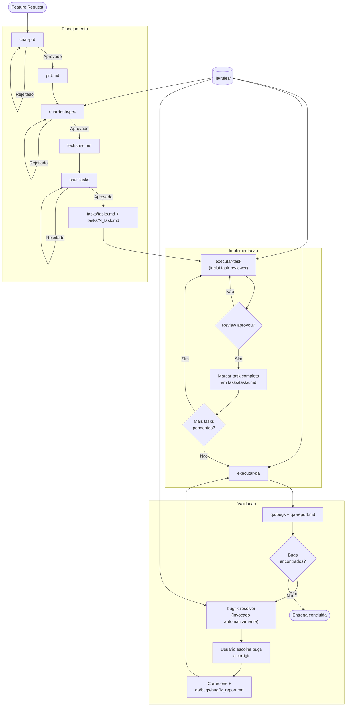
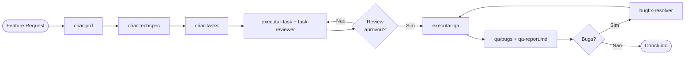

# Fluxo de Desenvolvimento com IA

Diagrama do workflow de desenvolvimento utilizando os comandos em `.ia/commands/` e agentes em `.ia/agents/`.

> **Diretório de artefatos**: Todos os artefatos ficam em `tasks-ia/[nome-funcionalidade]/`. Artefatos de QA em `qa/`, arquivos de bug em `qa/bugs/`.
>
> **Dependências**: Os comandos utilizam templates de `.ia/templates/` (incl. `bugfix.md`), o agente de review (`.ia/agents/task-reviewer.md`) e o agente de correção de bugs (`.ia/agents/bugfix-resolver.md`).

## Resumo dos Comandos e Agentes

| Comando/Agente | Descrição |
|----------------|-----------|
| **criar-prd** | Cria PRD com esclarecimentos, planejamento e template padronizado |
| **criar-techspec** | Gera Tech Spec baseada no PRD e análise do projeto |
| **criar-tasks** | Gera lista de tarefas (tasks/tasks.md) e arquivos individuais (tasks/N_task.md) |
| **executar-task** | Implementa tarefa, invoca task-reviewer e marca conclusão em tasks/tasks.md |
| **task-reviewer** | Agente invocado pelo executar-task após cada task. Revisa código contra padrões do projeto, gera `tasks/[N]_task_review.md`. Se não aprovar (CHANGES REQUESTED), o fluxo volta para executar-task |
| **executar-qa** | Valida contra PRD/TechSpec, testes E2E, a11y. Para cada bug, cria `qa/bugs/[NUM]_bug.md` (template `bugfix.md`), gera `qa/qa-report.md` e **invoca automaticamente** o **bugfix-resolver** |
| **bugfix-resolver** | Agente invocado pelo executar-qa quando há bugs. Lê `qa/qa-report.md` e `qa/bugs/[NUM]_bug.md`, pergunta quais corrigir, implementa as correções e gera `qa/bugs/bugfix_report.md`. Após corrigir, o fluxo volta para executar-qa para revalidar |

## Fluxo Simplificado (Linear)

## Artefatos por Etapa

| Etapa | Artefatos gerados |
|-------|-------------------|
| criar-prd | `prd.md` |
| criar-techspec | `techspec.md` |
| criar-tasks | `tasks/tasks.md`, `tasks/[N]_task.md` |
| executar-task | Código + `tasks/[N]_task_review.md` (atualiza `tasks/tasks.md`) |
| executar-qa | `qa/bugs/[NUM]_bug.md` (um por bug, via template `bugfix.md`), `qa/qa-report.md` |
| bugfix-resolver | Correções + atualização de `qa/bugs/[NUM]_bug.md`, `qa/bugs/bugfix_report.md` |

## Templates

| Template | Usado por | Artefato(s) | Descrição |
|----------|-----------|-------------|-----------|
| `prd-template.md` | criar-prd | `prd.md` | Estrutura do PRD: visão geral, objetivos, histórias de usuário, funcionalidades, requisitos funcionais |
| `techspec-template.md` | criar-techspec | `techspec.md` | Estrutura da Tech Spec: resumo executivo, arquitetura, design de implementação, interfaces |
| `tasks-template.md` | criar-tasks | `tasks/tasks.md` | Lista de tarefas com checkboxes e títulos numerados |
| `task-template.md` | criar-tasks | `tasks/[N]_task.md` | Arquivo individual por task: visão geral, requisitos, subtarefas, critérios de sucesso, testes |
| `bugfix.md` | executar-qa, bugfix-resolver | `qa/bugs/[NUM]_bug.md` | Metadados, descrição, evidências, passos de reprodução, causa raiz, correção sugerida |
