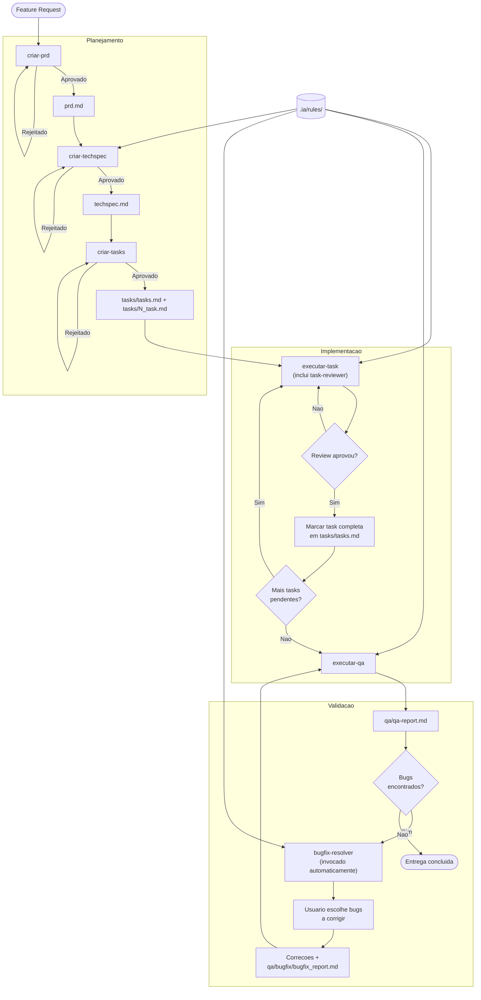
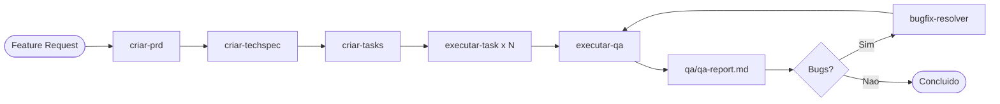

# Fluxo de Desenvolvimento com IA

Diagrama do workflow de desenvolvimento utilizando os comandos em `.ia/commands/` e agentes em `.ia/agents/`.

> **Diretório de artefatos**: Todos os artefatos ficam em `tasks-ia/[nome-funcionalidade]/`. Artefatos de QA em `qa/` e `qa/bugfix/`.
>
> **Dependências**: Os comandos utilizam templates de `.ia/templates/`, o agente de review (`.ia/agents/task-reviewer.md`) e o agente de correção de bugs (`.ia/agents/bugfix-resolver.md`).

## Resumo dos Comandos e Agentes

| Comando/Agente | Descrição |
|----------------|-----------|
| **criar-prd** | Cria PRD com esclarecimentos, planejamento e template padronizado |
| **criar-techspec** | Gera Tech Spec baseada no PRD e análise do projeto |
| **criar-tasks** | Gera lista de tarefas (tasks/tasks.md) e arquivos individuais (tasks/N_task.md) |
| **executar-task** | Implementa tarefa, executa task-reviewer (agente interno) e marca conclusão |
| **executar-qa** | Valida contra PRD/TechSpec, testes E2E, a11y e gera relatório. **Se houver bugs**, invoca automaticamente o **bugfix-resolver** |
| **bugfix-resolver** | Agente invocado pelo executar-qa quando há bugs. Lê `qa/qa-report.md`, pergunta quais corrigir, implementa as correções e gera `qa/bugfix/bugfix_report.md` |
| **executar-bugfix** | Comando manual alternativo. Corrige **todos** os bugs do `qa/qa-report.md` e cria testes de regressão (sem interação de escolha) |

## Fluxo Simplificado (Linear)

## Artefatos por Etapa

| Etapa | Artefatos gerados |
|-------|-------------------|
| criar-prd | `prd.md` |
| criar-techspec | `techspec.md` |
| criar-tasks | `tasks/tasks.md`, `tasks/[N]_task.md` |
| executar-task | Código + `tasks/[N]_task_review.md` (atualiza `tasks/tasks.md`) |
| executar-qa | `qa/qa-report.md` |
| bugfix-resolver | Correções + `qa/bugfix/[N]_bug.md`, `qa/bugfix/bugfix_report.md` |
| executar-bugfix | Correções + testes de regressão + `qa/bugfix/bugfix_report.md` (comando manual) |
