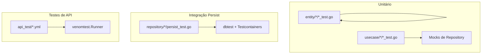

# Mapa Arquitetural e Estrutura de Diretórios

## Arquitetura do Sistema

Este projeto segue uma arquitetura em camadas (Layered Architecture) com separação clara de responsabilidades, inspirada em Clean Architecture.

### Diagrama de Camadas

```
┌─────────────────────────────────────────────────────────────┐
│                 CAMADA DE APRESENTAÇÃO                      │
│                     (Controller)                            │   
├─────────────────────────────────────────────────────────────┤
│  • Handlers (task_handler.go, team_handler.go)              │
│    Processam requisições HTTP (Age como um controller)      │
│  • DTOs (Data Transfer Objects)                             │
│    Conversão JSON ↔ Entidades                               │
│  • Middleware (Content-Type, Transações, Logger JSON)       │
│    Valida Content-Type, transações de BD, log de requests   │
│  • Rotas (route.go)                                         │
│    Define endpoints REST                                    │
└─────────────────────────────────────────────────────────────┘
                            │
                            ▼
┌─────────────────────────────────────────────────────────────┐
│                  CAMADA DE CASOS DE USO                     │
│                  (Use Cases / Application)                  │
├─────────────────────────────────────────────────────────────┤
│  • Orquestração de regras de negócio                        │
│  • Coordenação entre entidades e repositórios                │
│  • Validações de aplicação                                  │
│  • Configurações de domínio (paginação, limites)            │
└─────────────────────────────────────────────────────────────┘
                            │
                            ▼
┌─────────────────────────────────────────────────────────────┐
│                  CAMADA DE ENTIDADES                        │
│                  (Domain Entities)                          │
├─────────────────────────────────────────────────────────────┤
│  • Entidades puras (Task, Team)                             │
│  • Validações de domínio                                    │
│  • Regras de negócio básicas                                │
│  • Sem dependências de infraestrutura                       │
└─────────────────────────────────────────────────────────────┘
                            │
                            ▼
┌─────────────────────────────────────────────────────────────┐
│                  CAMADA DE REPOSITÓRIO                     │
│                (Repository / Data Access)                   │
├─────────────────────────────────────────────────────────────┤
│  • Interfaces de persistência                               │
│  • Implementação PostgreSQL (persist.go)                    │
│  • Queries e Operações de BD                                │
│  • Abstração da camada de dados                             │
└─────────────────────────────────────────────────────────────┘
                            │
                            ▼
┌─────────────────────────────────────────────────────────────┐
│                CAMADA DE INFRAESTRUTURA                     │
│                (Cross-cutting Concerns)                     │
├─────────────────────────────────────────────────────────────┤
│  • Database (Conexão PostgreSQL)                            │
│  • HTTP Utilities                                           │
│  • Logger                                                   │
│  • Server                                                   │
│  • Error Handling                                           │
│  • platform/testing/                                        │
│    (dbtest, testenv, venomtest — infra de testes)           │
└─────────────────────────────────────────────────────────────┘
                            │
                            ▼
┌─────────────────────────────────────────────────────────────┐
│              CAMADA DE CONFIGURAÇÃO                         │
│              (Infrastructure Layer)                         │
├─────────────────────────────────────────────────────────────┤
│  • Config (internal/config)                                 │
│    Carregamento de configurações TOML                       │
│  • Test Config (internal/testing/configtest)                │
│    Configuração para testes (.env + TOML)                   │
│  • Environment Variables                                    │
└─────────────────────────────────────────────────────────────┘
                            │
                            ▼
┌─────────────────────────────────────────────────────────────┐
│                      BANCO DE DADOS                         │
│                    PostgreSQL                               │
└─────────────────────────────────────────────────────────────┘
```

### Fluxo de Dados

```
HTTP Request
    │
    ▼
[Router] → Define rotas e aplica middlewares (logger de requests em JSON, etc.)
    │
    ▼
[Middleware] → Valida Content-Type (quando exigido), gerencia transações de BD
    │
    ▼
[Handler - Controller] → Valida entrada, converte DTOs para entidades
    │
    ▼
[UseCase] → Orquestra regras de negócio, coordena operações
    │
    ▼
[Entity] → Validações de domínio e regras básicas
    │
    ▼
[Repository] → Interface de persistência
    │
    ▼
[Repository Implementation] → Executa operações no banco de dados
    │
    ▼
[Database] → PostgreSQL via GORM
    │
    ▼
HTTP Response
```

## Estrutura de Diretórios

```
task-manager/  # Raiz do projeto
│
├── 📂 db/                                    # Migrações, Seeds e Fixtures do Banco de Dados
│   ├── 📂 migrate/                           # Migrações do banco de dados
│   │   ├── 000001_create_tasks_table.up.sql
│   │   ├── 000001_create_tasks_table.down.sql
│   │   ├── 000002_create_teams_table.up.sql
│   │   ├── 000002_create_teams_table.down.sql
│   │   ├── 000003_add_team_id_to_tasks.up.sql
│   │   └── 000003_add_team_id_to_tasks.down.sql
│   ├── 📂 seed/                              # Dados iniciais (desenvolvimento)
│   │   └── populate.sql
│   └── 📂 fixtures/                          # Dados para testes
│       └── tasks_minimal.sql
│
├── 📂 etc/                                   # Arquivos de Configuração
│   ├── config.toml.example                   # Template de exemplo
│   ├── config_test.toml                      # Configuração para testes
│   ├── .env.example                          # Template de variáveis de ambiente
│   ├── .env.test                             # Variáveis de ambiente (testes)
│   └── air.toml                              # Configuração do Air (live reload)
│
├── 📂 cmd/                                   # Ponto de entrada da aplicação
│   └── main.go                               # Entry point da aplicação
│
├── 📂 internal/                              # Código interno da aplicação
│   │
│   ├── 📂 config/                            # Configuração da aplicação
│   │   └── loader.go                         # Carregamento de configurações TOML
│   │
│   ├── 📂 paths/                             # Resolução de caminhos do projeto
│   │   └── paths.go                          # Funções para obter paths (migrations, seeds, config, etc.)
│   │
│   ├── 📂 testing/                           # Testing específico da aplicação
│   │   └── 📂 configtest/                    # Configuração para testes
│   │       └── loader.go                     # Carregamento (.env + TOML) para testes
│   │
│   ├── 📂 transport/                         # Camada de Transporte (HTTP)
│   │   ├── route.go                          # Definição de rotas
│   │   ├── task_handler.go                   # Handler de Tasks
│   │   ├── team_handler.go                   # Handler de Teams
│   │   ├── main_test.go                      # Setup de testes de integração
│   │   ├── task_handler_test.go              # Testes de integração dos endpoints de Tasks
│   │   ├── team_handler_test.go              # Testes de integração dos endpoints de Teams 
│   │   │
│   │   ├── 📂 dto/                           # Data Transfer Objects
│   │   │   ├── task_request.go               # DTOs de requisição de Tasks
│   │   │   ├── task_response.go              # DTOs de resposta de Tasks
│   │   │   ├── team_request.go               # DTOs de requisição de Teams
│   │   │   ├── team_response.go              # DTOs de resposta de Teams
│   │   │   └── status_request.go             # DTO de atualização de status
│   │   │
│   │   └── 📂 middleware/                    # Middlewares HTTP
│   │       ├── content_type.go               # RequireContentTypeJSON — valida Content-Type
│   │       ├── logger_json.go                # JSONLogFormatter — log de requests em NDJSON
│   │       └── database.go                   # DatabaseWithTransaction, DatabaseWithoutTransaction
│   │
│   ├── 📂 usecase/                           # Camada de Casos de Uso (Application)
│   │   │
│   │   ├── 📂 task/                          # Casos de uso de Tasks
│   │   │   ├── task.go                       # Funções de caso de uso (Create, Update, etc.)
│   │   │   ├── config.go                     # Configuração do caso de uso (paginação, limites)
│   │   │   ├── task_test.go                  # Testes dos casos de uso
│   │   │   └── main_test.go                  # Setup de testes
│   │   │
│   │   └── 📂 team/                          # Casos de uso de Teams
│   │       ├── team.go                       # Funções de caso de uso (Create, Associate, etc.)
│   │       ├── config.go                     # Configuração do caso de uso (paginação, limites)
│   │       ├── team_test.go                  # Testes dos casos de uso
│   │       └── main_test.go                  # Setup de testes
│   │
│   ├── 📂 entity/                            # Camada de Entidades (Domain)
│   │   │
│   │   ├── 📂 task/                          # Entidade Task
│   │   │   ├── task.go                       # Entidade e validações de domínio
│   │   │   └── task_test.go                  # Testes da entidade
│   │   │
│   │   └── 📂 team/                          # Entidade Team
│   │       ├── team.go                       # Entidade e validações de domínio
│   │       └── team_test.go                  # Testes da entidade
│   │
│   ├── 📂 repository/                        # Camada de Repositório (Data Access)
│   │   │
│   │   ├── 📂 task/                          # Repositório de Tasks
│   │   │   ├── persist.go                    # Interface Persistent e implementação PostgreSQL
│   │   │   ├── persist_test.go              # Testes de persistência
│   │   │   ├── persist_mock.go              # Mock para testes
│   │   │   └── main_test.go                  # Setup de testes
│   │   │
│   │   └── 📂 team/                          # Repositório de Teams
│   │       ├── persist.go                    # Interface Persistent e implementação PostgreSQL
│   │       ├── persist_test.go              # Testes de persistência
│   │       ├── persist_mock.go              # Mock para testes
│   │       └── main_test.go                  # Setup de testes
│   │
│   ├── 📂 platform/                          # Plataforma e Infraestrutura
│   │   ├── 📂 database/                      # Gerenciamento de banco de dados
│   │   │   ├── options.go                    # Option, WithDBTransaction, WithDBWithoutTransaction (para InjectDBsIntoContext)
│   │   │   └── postgres.go                   # Conexão PostgreSQL via GORM
│   │   │
│   │   ├── 📂 errors/                        # Tratamento de erros
│   │   │   └── error.go                      # Definições de erros customizados
│   │   │
│   │   ├── 📂 http/                          # Utilitários HTTP genéricos
│   │   │   ├── request.go                    # Parsing (JSON, query params)
│   │   │   └── response.go                   # Formatação de respostas
│   │   │
│   │   ├── 📂 logger/                        # Sistema de logging
│   │   │   └── logger.go                     # Configuração do logger
│   │   │
│   │   ├── 📂 server/                        # Servidor HTTP
│   │   │   └── server.go                     # Inicialização do servidor
│   │   │
│   │   └── 📂 testing/                       # Infraestrutura de testes
│   │       ├── 📂 testenv/                   # Environment unificado (DB + HTTP + Venom)
│   │       │   ├── environment.go            # Setup centralizado de ambientes de teste
│   │       │   └── options.go                # Functional options (WithDatabase, WithNewDatabase, WithHTTPServer, etc)
│   │       ├── 📂 dbtest/                    # Database testing utilities
│   │       │   ├── postgres.go               # Container PostgreSQL otimizado (testcontainers)
│   │       │   ├── options.go                # WithImage, WithMigrations
│   │       │   ├── fixtures.go               # LoadFixtures, ResetWithFixtures — db/fixtures
│   │       │   ├── cleanup.go                # CleanDatabase — TRUNCATE
│   │       │   └── transaction.go            # SetupDBWithTransaction, SetupDBWithoutTransaction
│   │       ├── 📂 assert/                    # Assertion helpers
│   │       │   └── errors.go                 # CompareErrors() - comparação de erros
│   │       └── 📂 venomtest/                 # Runner Venom
│   │           ├── runner.go                 # Execução de suites Venom YAML
│   │           └── options.go                # WithSuiteRoot, WithVerbose
│   │
│
├── 📂 api_test/                              # Testes de integração API (Venom)
│   ├── 📂 success/                           # Casos de sucesso (HTTP 200, 201)
│   │   ├── 📂 tasks/                         # Testes de endpoints de Tasks
│   │   │   ├── 📂 create/                    # POST /api/tasks
│   │   │   │   ├── basic.yml                 # Casos básicos de criação
│   │   │   │   ├── edge_cases.yml            # Casos extremos
│   │   │   │   └── corner_cases.yml          # Casos especiais
│   │   │   ├── 📂 update/                    # PUT /api/tasks/{uuid}
│   │   │   │   ├── basic.yml                 # Casos básicos de atualização
│   │   │   │   ├── edge_cases.yml            # Casos extremos
│   │   │   │   └── corner_cases.yml          # Casos especiais
│   │   │   ├── 📂 delete/                    # DELETE /api/tasks/{uuid}
│   │   │   │   ├── basic.yml                 # Casos básicos de exclusão
│   │   │   │   └── corner_cases.yml          # Casos especiais
│   │   │   └── ...                           # (outros: retrieve, list, status)
│   │   └── 📂 teams/                         # Testes de endpoints de Teams
│   │       ├── 📂 create/                    # POST /api/teams
│   │       │   ├── basic.yml                 # Casos básicos de criação
│   │       │   └── edge_cases.yml            # Casos extremos
│   │       └── ...                           # (outros: list, retrieve, etc.)
│   └── 📂 failure/                           # Casos de falha (HTTP 400, 404, 422)
│       ├── 📂 tasks/                         # Testes de erros em endpoints de Tasks
│       │   ├── 📂 create/                    # Erros em POST /api/tasks
│       │   │   ├── bad_request.yml           # HTTP 400
│       │   │   ├── validation_errors.yml     # HTTP 422
│       │   │   └── missing_content_type.yml  # Content-Type ausente
│       │   ├── 📂 update/                    # Erros em PUT /api/tasks/{uuid}
│       │   │   ├── bad_request.yml           # HTTP 400
│       │   │   ├── validation_errors.yml     # HTTP 422
│       │   │   ├── not_found.yml             # HTTP 404
│       │   │   └── missing_content_type.yml  # Content-Type ausente
│       │   └── ...                           # (outros: delete, retrieve, etc.)
│       └── 📂 teams/                         # Testes de erros em endpoints de Teams
│           ├── 📂 create/                    # Erros em POST /api/teams
│           │   ├── bad_request.yml           # HTTP 400
│           │   └── validation_errors.yml     # HTTP 422
│           └── ...                           # (outros: retrieve, associate, etc.)
│
├── go.mod                                    # Dependências Go
├── go.sum                                    # Checksums das dependências
│
├── 📂 var/                                   # Arquivos gerados (ex.: cobertura)
│   └── .gitkeep                              # Mantém o diretório versionado; coverage.html, coverage.out ao rodar testes com cobertura
│
├── docker-compose.yml                        # Configuração Docker
├── Makefile                                  # Comandos automatizados
└── .gitignore                                # Arquivos ignorados pelo Git
```

## Detalhamento das Camadas

### 1. Camada de Transporte (`internal/transport/`)

**Responsabilidades:**
- Receber requisições HTTP
- Validar entrada (DTOs)
- Chamar a camada de domínio
- Formatar respostas HTTP
- Gerenciar transações via middleware

**Componentes:**
- **Handlers**: `task_handler.go`, `team_handler.go` - HTTP Handlers
- **DTOs** (`dto/`): Conversão entre JSON e entidades de domínio
- **Middleware** (`middleware/`): RequireContentTypeJSON (validação de Content-Type), JSONLogFormatter (log de requests em NDJSON), gerenciamento de transações de banco
- **Routes** (`route.go`): Definição de endpoints REST via `Routes()`

**Estrutura de Imports:**
- Todos os imports internos usam o prefixo `taskmanager/internal/...`
- Exemplo: `taskmanager/internal/transport`, `taskmanager/internal/usecase/task`, `taskmanager/internal/entity/task`, `taskmanager/internal/repository/task`

**Padrão de Dependências:**
- Handlers importam `internal/usecase/*` para casos de uso
- Handlers importam `internal/entity/*` apenas para tipos (quando necessário)
- Handlers não importam `internal/repository/*` diretamente

### 2. Camada de Casos de Uso (`internal/usecase/`)

**Responsabilidades:**
- Orquestrar regras de negócio
- Coordenar operações entre entidades e repositórios
- Aplicar validações de aplicação
- Gerenciar configurações de domínio (paginação, limites)

**Componentes:**
- **task/**: Casos de uso de tarefas
  - `Create()`: Criação com regras de negócio (trim, status inicial)
  - `Update()`: Atualização com validações
  - `UpdateStatus()`: Transição de status com validação
  - `ListPaginated()`: Listagem com paginação e filtros
  - Configuração: `config.go` com `Configuration` e `LoadConfig()` para limites de paginação
  
- **team/**: Casos de uso de equipes
  - `Create()`: Criação com regras de negócio
  - `AssociateTask()` / `DisassociateTask()`: Associação/desassociação com validações
  - `RetrieveByUUIDWithTasks()`: Recuperação com tarefas associadas
  - `ListPaginated()`: Listagem com paginação
  - Configuração: `config.go` com `Configuration` e `LoadConfig()` para limites de paginação

**Padrão de Dependências:**
- Importa `internal/entity/*` para entidades
- Importa `internal/repository/*` para persistência
- Não importa `internal/transport` ou `internal/platform` diretamente

### 3. Camada de Entidades (`internal/entity/`)

**Responsabilidades:**
- Definir entidades puras de domínio
- Implementar validações de domínio
- Aplicar regras de negócio básicas
- Manter independência de infraestrutura

**Componentes:**
- **task/**: Entidade Task
  - Estados: `to_do`, `in_progress`, `done`, `canceled`
  - `Validate()`: Validação de campos obrigatórios e limites
  - `ValidateTransitionTo()`: Validação de transições de estado
  - `EnsureTimestampsForStatus()`: Gerenciamento de timestamps por status
  - Hooks GORM: `BeforeCreate()` (UUID v7), `AfterFind()` (normalização UTC)
  
- **team/**: Entidade Team
  - `Validate()`: Validação de campos obrigatórios e limites
  - Relacionamento com Task via `TeamID`
  - Hooks GORM: `BeforeCreate()` (UUID v7), `AfterFind()` (normalização UTC)

**Padrão:**
- Entidades são puras, sem dependências de infraestrutura
- Validações focadas em regras de domínio
- Uso de GORM apenas para hooks e tags de mapeamento

### 4. Camada de Repositório (`internal/repository/`)

**Responsabilidades:**
- Definir interfaces de persistência
- Implementar acesso a dados
- Executar queries no banco de dados
- Mapear entidades para tabelas

**Componentes:**
- **task/**: Repositório de Tasks
  - Interface `Persistent` define contratos (Create, RetrieveByUUID, Update, Delete, ListPaginated, UpdateStatus, ListByTeamID)
  - Implementação `datasource` usa PostgreSQL via GORM
  - Injeção via `SetPersist()` para testes
  - Acesso ao banco via `database.DBFromContext()`
  
- **team/**: Repositório de Teams
  - Interface `Persistent` define contratos (Create, RetrieveByUUID, ListPaginated, RetrieveTaskTeamID, UpdateTaskTeamID)
  - Implementação `datasource` usa PostgreSQL via GORM
  - Injeção via `SetPersist()` para testes
  - Acesso ao banco via `database.DBFromContext()`

**Padrão:**
- Interface `Persistent` define contratos
- Implementação `datasource` usa GORM
- Injeção via `SetPersist()` e `Persist()` para testes e produção
- Tratamento de erros: `ErrNotFound` para registros não encontrados

### 5. Camada de Infraestrutura (`internal/platform/`)

**Responsabilidades:**
- Fornecer base técnica e implementações concretas para interação com sistemas externos (banco de dados, sistema de arquivos, rede).
- Isolar a aplicação de detalhes de framework e drivers.
- **Regra de Dependência:** Esta camada deve ser agnóstica ao negócio. Seus pacotes **não devem** importar pacotes como `internal/entity`, `internal/usecase`, `internal/repository` ou `internal/transport`. Eles funcionam como bibliotecas internas que poderiam, em teoria, ser reutilizadas em outros projetos.

**Componentes:**
- **database/**: Gerenciamento de conexão PostgreSQL
- **http/**: Parsing de requests e formatação de responses
- **logger/**: Sistema de logs estruturados
- **errors/**: Erros customizados da aplicação
- **server/**: Inicialização do servidor HTTP
- **testing/**: Infraestrutura de testes genérica e reutilizável
  - **testenv/**: Environment unificado para setup de testes (DB, HTTP, Venom). Servidor HTTP via `net/http/httptest` (interno). `RunVenomSuite`.
  - **dbtest/**: Container PostgreSQL (testcontainers com otimizações de performance), fixtures, cleanup, SetupDBWithTransaction/SetupDBWithoutTransaction (transaction.go)
  - **assert/**: Helper de comparação de erros (`CompareErrors()` que retorna diff string)
  - **venomtest/**: Runner para suites Venom; usado via testenv com `WithVenom` e `env.RunVenomSuite(t, suitePath)`

### 6. Camada de Configuração (`internal/config/`)

**Responsabilidades:**
- Carregamento e gerenciamento de configurações da aplicação
- Parsing de arquivos TOML com suporte a expansão de variáveis de ambiente

**Componentes:**
- **config/**: Carregamento de configurações TOML com expansão de variáveis de ambiente
  - `Load(path, v)`: Carrega configuração de arquivo TOML (caminho dado) com suporte a expansão de variáveis de ambiente
  - Suporta formato `${VAR_NAME}` e `${VAR_NAME:-default}` para variáveis de ambiente
  - Utiliza `pelletier/go-toml/v2` para parsing TOML
  - Usado em `cmd/main.go` com o caminho obtido via `paths.ConfigPath()`

### 7. Camada de Resolução de Caminhos (`internal/paths/`)

**Responsabilidades:**
- Conhecimento sobre a estrutura de diretórios do projeto
- Resolução de caminhos absolutos para recursos do projeto

**Componentes:**
- **paths/**: Resolução de caminhos do projeto
  - `RootDir()`, `MustRootDir()`: Encontram a raiz do projeto (onde está o `go.mod`)
  - `MigrationDir()`, `SeedDir()`, `FixtureDir()`, `APITestDir()`, `ConfigDir()`: Retornam caminhos de diretórios
  - `ConfigPath()`: Caminho de `etc/config.toml`; usado em `cmd/main.go`
  - `TestConfigPath()`, `TestEnvPath()`: Caminhos de `config_test.toml` e `.env.test`; usados em testes
  - Usado em `cmd/main.go` (config) e em testes (migrations, seeds, config de teste, testes de integração)

### 8. Camada de Testing Específico da Aplicação (`internal/testing/`)

**Responsabilidades:**
- Utilitários de teste específicos do projeto
- Helpers que dependem de conhecimento da aplicação

**Componentes:**
- **configtest/**: Carregamento de configurações para testes
  - `Load(configPath, envPath, v)`: Carrega variáveis de ambiente de `envPath` (.env) antes de carregar TOML de `configPath`
  - Usado em testes para carregar `config_test.toml` e `.env.test` (caminhos via `paths.TestConfigPath()` e `paths.TestEnvPath()`)
  - Permite configurações específicas para ambiente de testes
  - Depende de `internal/config` (por isso não está em `platform/testing`)

## Fluxo de uma Requisição

### Exemplo: Criar uma Task

```
1. HTTP POST /api/tasks
   │
   ▼
2. [cmd/main.go] → Inicializa servidor e registra rotas (transport.Routes())
   │   ├── Carrega configuração (via internal/config)
   │   ├── Carrega configurações de casos de uso (task.LoadConfig, team.LoadConfig)
   │   ├── Inicializa logger (via internal/platform/logger)
   │   └── Conecta ao banco (via internal/platform/database)
   │
   ▼
3. [internal/transport/route.go] → Roteia para POST /api/tasks; RequireContentTypeJSON valida
   │   Content-Type (404 se inválido); DatabaseWithTransaction(CreateTask) encadeia transação e handler
   │
   ▼
4. [internal/transport/middleware/database.go] → DatabaseWithTransaction: chama InjectDBsIntoContext(r.Context(), database.WithDBTransaction()) para colocar a transação no contexto, em seguida chama CreateTask
   │
   ▼
5. [internal/transport/task_handler.go] → CreateTask()
   │   ├── Decodifica JSON para DTO (via internal/platform/http)
   │   ├── Converte DTO para entidade Task (req.ToTask())
   │   ├── Chama internal/usecase/task.Create()
   │   └── Converte entidade para DTO de resposta (dto.ToTaskResponse) e retorna (status, body)
   │
   ▼
6. [internal/usecase/task/task.go] → Create()
   │   ├── Chama t.Validate() da entidade (valida campos)
   │   ├── Aplica regras de negócio (trim, status inicial)
   │   └── Chama internal/repository/task.Persist().Create()
   │
   ▼
7. [internal/repository/task/persist.go] → Create()
   │   ├── Obtém conexão do contexto (via internal/platform/database)
   │   └── Executa INSERT via GORM na entidade Task
   │
   ▼
8. [internal/platform/database/postgres.go] → GORM executa no PostgreSQL
   │
   ▼
9. [internal/transport/middleware/database.go] → DatabaseWithTransaction: commit (ou rollback em
   │   caso de erro) após o retorno do handler
   │
   ▼
10. [internal/transport/middleware/database.go] → DatabaseWithTransaction: escreve resposta
   │   (Content-Type, WriteHeader, Write) no ResponseWriter
   │
   ▼
11. HTTP 200 OK + JSON Response
```

## Estrutura do Banco de Dados

### Tabelas

**tasks:**
- `id` (PK, auto-increment)
- `uuid` (unique, UUID v7)
- `title` (string, not null)
- `description` (string, not null)
- `status` (VARCHAR(20) com valores restritos: to_do, in_progress, done, canceled)
- `started_at` (timestamp, nullable)
- `finished_at` (timestamp, nullable)
- `team_id` (FK, nullable, index)
- `created_at`, `updated_at`, `deleted_at` (soft delete)

**teams:**
- `id` (PK, auto-increment)
- `uuid` (unique, UUID v7)
- `name` (string, not null)
- `description` (string, not null)
- `created_at`, `updated_at`, `deleted_at` (soft delete)

### Relacionamentos

```
teams (1) ──────< (N) tasks
```

Uma equipe pode ter múltiplas tarefas, mas uma tarefa pertence a no máximo uma equipe.

## Tecnologias e Ferramentas

- **Linguagem**: Go 1.25
- **Framework Web**: Chi (go-chi/chi)
- **ORM**: GORM
- **Banco de Dados**: PostgreSQL
- **Configuração**: pelletier/go-toml/v2 (TOML parsing com expansão de variáveis de ambiente)
- **Logging**: slog (aplicação); middleware de request em NDJSON (transport, JSONLogFormatter)
- **Testes**: 
  - Go testing package (unitários e integração)
  - Testcontainers-go (containers PostgreSQL para testes)
  - Venom (testes de API em YAML)
  - google/go-cmp (comparações estruturais)
- **Containerização**: Docker Compose (serviços: `postgres`, `migrate`; testes usam testcontainers)
- **Comandos (Makefile)**: `db-up`, `db-down`, `migrate`, `migrate-down`, `seed`, `run`, `run-dev`, `test`, `coverage`. O target `seed` executa `db/seed/populate.sql` no Postgres via Docker (psql) e depende de `migrate`.
- **Migrações**: SQL direto (up/down)
- **Estrutura de Módulo**: Go modules com prefixo `taskmanager/internal/...` para imports internos

## Padrões Arquiteturais Utilizados

1. **Clean Architecture**: Separação em camadas independentes (Entity, UseCase, Repository, Transport)
2. **Layered Architecture**: Separação clara de responsabilidades por camada
3. **Repository Pattern**: Abstração da camada de persistência via interfaces
4. **Use Case Pattern**: Casos de uso orquestram a lógica de negócio
5. **DTO Pattern**: Transferência de dados entre camadas (Transport ↔ Entity)
6. **Dependency Injection**: Via interfaces e contexto (repositórios injetáveis)
7. **Dependency Rule**: Camadas internas não dependem de camadas externas
   - Entity não depende de nada
   - UseCase depende apenas de Entity e Repository
   - Repository depende apenas de Entity
   - Transport depende de UseCase e Entity
8. **Transaction Management**: Middleware para gerenciar transações
9. **Soft Delete**: Exclusão lógica de registros
10. **UUID v7**: Identificadores únicos ordenáveis por tempo (gerados no código Go via hooks `BeforeCreate` do GORM, não no banco de dados)

## Regra de Dependências (Clean Architecture)

A arquitetura segue a **Dependency Rule** de Clean Architecture, onde as dependências apontam sempre para dentro (camadas mais internas):

```
Transport (mais externa)
    ↓ depende de
UseCase
    ↓ depende de
Repository
    ↓ depende de
Entity (mais interna)
```

**Detalhamento:**

- **Entity** (`internal/entity/`): 
  - Não depende de nenhuma outra camada interna
  - Pode usar apenas bibliotecas externas (GORM para tags, uuid, etc.)
  - Contém apenas lógica de domínio pura

- **Repository** (`internal/repository/`):
  - Depende apenas de `internal/entity/*`
  - Depende de `internal/platform/database` para acesso ao banco
  - Define interfaces que são implementadas internamente

- **UseCase** (`internal/usecase/`):
  - Depende de `internal/entity/*` para entidades
  - Depende de `internal/repository/*` para persistência
  - Não depende de `internal/transport` ou `internal/platform` diretamente (código de produção)
  - **Exceção para testes**: Testes de usecase podem depender de `internal/platform/testing` (utilitários genéricos como `assert.CompareErrors`)

- **Transport** (`internal/transport/`):
  - Depende de `internal/usecase/*` para casos de uso
  - Depende de `internal/entity/*` para tipos (quando necessário)
  - Depende de `internal/platform/http` para utilitários HTTP
  - Não depende de `internal/repository/*` diretamente

- **Platform** (`internal/platform/`):
  - Não depende de nenhuma camada de negócio
  - Funciona como biblioteca interna reutilizável
  - **Nota sobre testes**: `internal/platform/testing` contém utilitários genéricos de infraestrutura de testes (assert, dbtest, testenv, venomtest) que podem ser usados por qualquer camada em seus testes, sem violar a regra de dependências

## Testes

### Estratégia em 3 níveis

- **Unitário**: 
  - Entidades: `entity/*/*_test.go` (ex. `task_test.go`, `team_test.go`) - testam validações e regras de domínio
  - Casos de uso: `usecase/*/*_test.go` (ex. `task_test.go`, `team_test.go`) - testam orquestração com mocks de repositório
- **Integração (persistência)**: `repository/*/persist_test.go` com PostgreSQL real via Testcontainers
- **API (Venom)**: specs em `api_test/` (YAML); execução em `transport/task_handler_test.go` e `transport/team_handler_test.go` via `testenv` + `WithVenom` + `env.RunVenomSuite(t, path)`. `transport/main_test.go` fornece `TestMain` (container DB compartilhado).



### Testes de API (Venom)

**Local e ferramenta:** `api_test/`, Venom (YAML). Responsabilidade: documentar expectativas da API e validar fluxos via HTTP.

**Estrutura:**

- **success/**: Casos de sucesso (HTTP 200, 201). Organizado por recurso (`tasks/`, `teams/`) e operação (`create/`, `update/`, etc.). Arquivos: `basic.yml`, `edge_cases.yml`, `corner_cases.yml`.
- **failure/**: Casos de erro. Mesma organização por recurso e operação. Arquivos: `bad_request.yml`, `validation_errors.yml`, `not_found.yml`, `missing_content_type.yml`.

**Categorias de sucesso:**

- **Basic**: Casos de uso padrão, fluxos principais com valores normais. Validações básicas (status code, campos obrigatórios); comportamento esperado em uso normal.
- **Edge Cases**: Valores limites de um único parâmetro (mínimo, máximo ou que excedem limites). Ex.: strings no tamanho max/min permitido, paginação extrema (`limit=0`, `limit=max`, `page=99999`), valores que a API normaliza automaticamente.
- **Corner Cases**: Múltiplos fatores ao mesmo tempo ou comportamentos menos óbvios. Ex.: caracteres especiais/Unicode/emojis, parâmetros duplicados na query, idempotência (operação repetida com mesmo resultado), trim de espaços.

**Categorias de falha:**

- `bad_request.yml`: HTTP 400 — JSON inválido, tipos errados, UUID inválido.
- `validation_errors.yml`: HTTP 422 — campos vazios, faltando ou inválidos.
- `not_found.yml`: HTTP 404 — recurso não encontrado.
- `missing_content_type.yml`: Rejeição quando falta o header Content-Type.

**Recursos do Venom:**

- Extração e reutilização de variáveis (`{{.variable_name}}`).
- Asserções sobre status code, estrutura JSON e valores.

### Infraestrutura de testes (Go)

- **testenv**: Setup unificado com `WithDatabase` ou `WithNewDatabase`, `WithHTTPServer`, `WithVenom`. `env.RunVenomSuite(t, suitePath)` para suites Venom (exige `WithHTTPServer` + `WithVenom`). Cleanup via `t.Cleanup()`. Entre subtestes use `dbtest.ResetWithFixtures(env.DB, paths.FixtureDir(), "tasks_minimal.sql")` para garantir estado limpo.

```go
env := testenv.Setup(t,
    testenv.WithDatabase(databaseTest, dbtest.WithMigrations(paths.MigrationDir())),
    testenv.WithHTTPServer(Routes()),
    testenv.WithVenom(venomtest.WithSuiteRoot(paths.APITestDir()), venomtest.WithVerbose(1)),
)
resetWithMinimalData := func() { dbtest.ResetWithFixtures(env.DB, paths.FixtureDir(), "tasks_minimal.sql") }
// Em cada subteste: if tt.setup != nil { tt.setup() }; env.RunVenomSuite(t, tt.path)
```

- **dbtest**: `dbtest.SetupDBWithTransaction(t, ctx)` retorna uma cópia de `ctx` com a transação anexada (rollback via `t.Cleanup()`). Preserva valores já existentes em `ctx`; se `ctx` for nil, usa `context.Background()`. Para testes sem transação: `dbtest.SetupDBWithoutTransaction(t, ctx)`.

```go
ctx := dbtest.SetupDBWithTransaction(t, tt.ctx)
err := p.Create(ctx, task)
```

- **assert**: `CompareErrors(got, want)` retorna diff string (vazia se iguais); `cmp.Diff` para valores. Permite controlar quando falhar e mensagens por contexto.
- **Container PostgreSQL**: flags `fsync=off`, `synchronous_commit=off`, `full_page_writes=off` e tmpfs em `/var/lib/postgresql` — ~2–3x mais rápido, dados em memória.

### Testcontainers e Paralelismo Entre Pacotes

#### Modelo de execução do `go test`

O `go test` compila cada pacote em um **binário separado** e executa cada um como um **processo independente do sistema operacional**. Isso significa que pacotes rodando em paralelo possuem:

- **PIDs diferentes** — processos distintos no SO
- **Espaços de memória isolados** — variáveis globais não são compartilhadas entre pacotes
- **Containers Docker independentes** — cada `TestMain` cria seu próprio container PostgreSQL com porta aleatória

```
go test ./internal/repository/task/... ./internal/repository/team/... ./internal/transport/...

┌─────────────────────────┐  ┌─────────────────────────┐  ┌─────────────────────────┐
│ Processo 1 (PID 12345)  │  │ Processo 2 (PID 12346)  │  │ Processo 3 (PID 12347)  │
│ repository/task         │  │ repository/team         │  │ transport               │
│                         │  │                         │  │                         │
│ Memória própria         │  │ Memória própria         │  │ Memória própria         │
│ database.SetDB(db) ─┐   │  │ database.SetDB(db) ─┐   │  │ database.SetDB(db) ─┐   │
│                     │   │  │                     │   │  │                     │   │
│ Container A ◄───────┘   │  │ Container B ◄───────┘   │  │ Container C ◄───────┘   │
│ postgres:18-alpine      │  │ postgres:18-alpine      │  │ postgres:18-alpine      │
│ porta 55432             │  │ porta 55489             │  │ porta 55501             │
└─────────────────────────┘  └─────────────────────────┘  └─────────────────────────┘
         ▲                            ▲                            ▲
         │                            │                            │
         └── Sem referência cruzada ──┴── Isolamento total ────────┘
```

Quando `repository/task` derruba seu container, o container de `repository/team` continua rodando normalmente. O `go test` controla o grau de paralelismo entre pacotes via flag `-p` (padrão: `GOMAXPROCS`).

#### Container por pacote via TestMain

Cada pacote que precisa de banco cria **um único container** no `TestMain`, compartilhado por todos os testes daquele pacote. O container é destruído ao final da execução do pacote:

```go
var databaseTest *dbtest.Container

func TestMain(m *testing.M) {
    os.Exit(func(m *testing.M) int {
        // ... load config ...

        var err error
        if databaseTest, err = dbtest.SetupDatabase(nil,
            dbtest.WithMigrations(paths.MigrationDir()),
        ); err != nil {
            log.Fatalf("Failed to setup database: %v", err)
        }
        defer func() {
            if err := databaseTest.TeardownDatabase(); err != nil {
                log.Printf("Failed to teardown database: %v", err)
            }
        }()

        return m.Run()
    }(m))
}
```

Os testes recebem o container via `testenv.WithDatabase(databaseTest)`, que registra a conexão no pacote `database` global (do processo):

```go
env := testenv.Setup(t,
    testenv.WithDatabase(databaseTest),
)
```

#### Otimizações do container de teste

O container PostgreSQL é configurado para máxima velocidade, sacrificando durabilidade (aceitável em testes):

| Configuração | Efeito |
|---|---|
| `fsync=off` | Não sincroniza para disco |
| `synchronous_commit=off` | Não espera flush do WAL |
| `full_page_writes=off` | Não escreve páginas completas |
| `tmpfs /var/lib/postgresql` | Dados em memória RAM |

#### Isolamento entre testes dentro do pacote

**Testes de repository** — isolamento via transação com rollback automático:

```go
t.Run(tt.name, func(t *testing.T) {
    ctx := dbtest.SetupDBWithTransaction(t, tt.ctx)
    // BEGIN transaction
    // ... operações do teste ...
    // t.Cleanup → ROLLBACK (dados nunca persistem)
})
```

**Testes de transport** — isolamento via TRUNCATE + fixtures. O middleware comita transações em caso de sucesso (comportamento real da API), então dados persistem e o estado é resetado entre subtestes:

```go
resetWithMinimalData := func() {
    dbtest.ResetWithFixtures(env.DB, paths.FixtureDir(), "tasks_minimal.sql")
}

t.Run(tt.name, func(t *testing.T) {
    resetWithMinimalData()         // TRUNCATE + INSERT fixtures
    env.RunVenomSuite(t, tt.path)  // HTTP request → middleware commit → dados persistem
})
```

#### Seed vs Fixtures

- **Seed** (`db/seed/`): Dados para desenvolvimento e demonstração. Em ambiente local: `make seed` (roda `db/seed/populate.sql` no Postgres via Docker; depende de `migrate`).
- **Fixtures** (`db/fixtures/`): Dados para testes. Carregado via `dbtest.LoadFixtures(db, paths.FixtureDir(), "arquivo.sql")` ou `dbtest.ResetWithFixtures(db, paths.FixtureDir(), "tasks_minimal.sql")` (limpa + carrega). Cada subteste deve chamar `ResetWithFixtures` no `setup` para garantir estado limpo.
- **Padrão nos testes**: `resetWithMinimalData := func() { dbtest.ResetWithFixtures(env.DB, paths.FixtureDir(), "tasks_minimal.sql") }` e passar `resetWithMinimalData` no `setup` de cada caso. Novas fixtures podem ser criadas em `db/fixtures/` (ex. `pagination.sql`) e referenciadas por nome.

### Organização e execução

- **Build tags**: `//go:build test` em testes que usam DB/containers. `go test -tags=test ./...` para suite completa; sem tag para unitários leves (ex. `task_test.go`).
- **Boas práticas**: table-driven, `t.Run()` por caso, `t.Helper()` em helpers, `t.Cleanup()` para cleanup, isolamento por transação em testes de persistência.
- **Container compartilhado**: Se inicializado no `TestMain` via `SetupDatabase()`, é passado explicitamente para os testes usando `WithDatabase(databaseTest)`. Se não houver container no TestMain, use `WithNewDatabase(...)` para criar um novo container.
